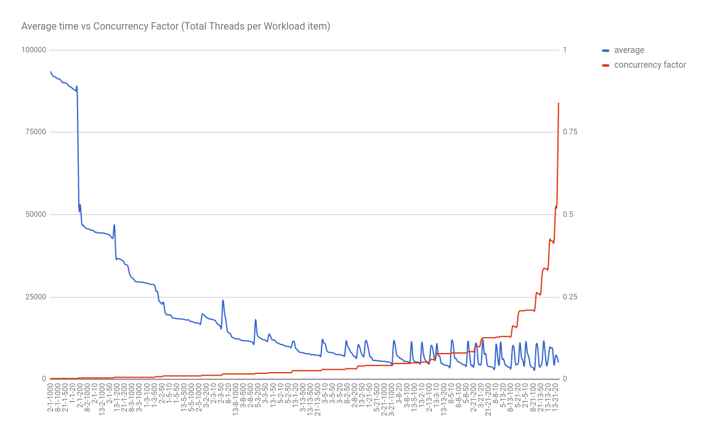
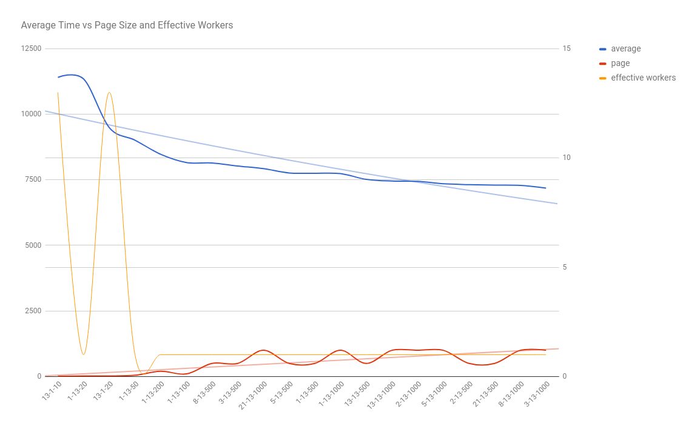
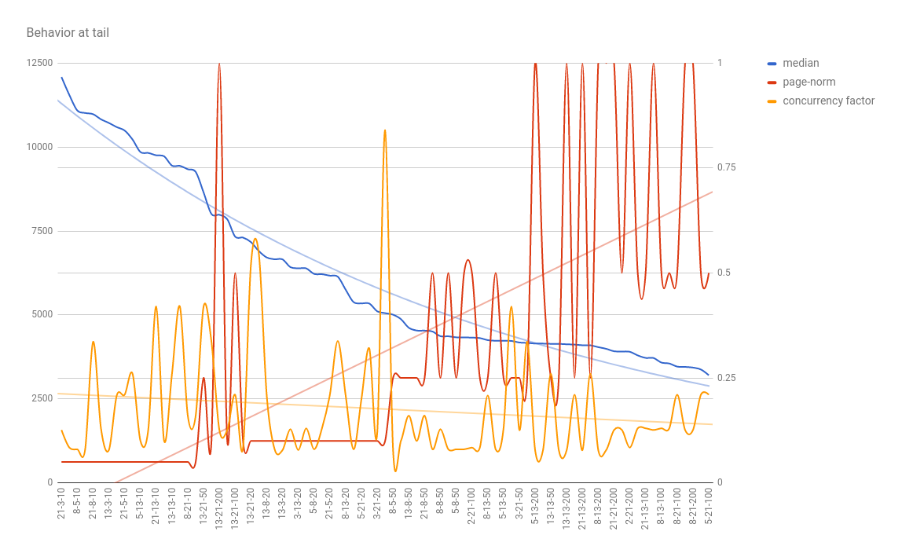

# Performance Experiment

Experiment to identify the behavior of the application to different execution arguments

## Workload Description

The experimental workload consists in searching for the most popular jar file inside an Artifacotry repository containing 1087 items out of which 505 are Jar files.

## Execution scenarios

The scenarios are defined by the combination of three variables:

- **Workers**: Max number of concurrent workers
- **Threads**: Max number of threads for each worker
- **Pages**: Number of items to be processed for each worker

The possible values for each variable are:

- **Workers**: 1, 2, 3, 5, 8, 13, 21
- **Threads**: 1, 2, 3, 5, 8, 13, 21
- **Pages**: 10, 20, 50, 100, 200, 500, 1000

A single scenario is identified by the label \<Workers>-\<Threads>-\<Pages>. For instance, the scenario 2-10-200 correspond to the scenario where the values of the variables Workers, Threads and Pages are 2, 10 and 200, respectively.

Each scenario is executed 5 times.

## Execution Environment
- CPU: Intel I7 7700K @ 4.20GHz
- Memory: 16 GB DDR4
- JDK: 1.8.0_121
- Operational System: Ubuntu 16.10 yakkety 64 bits
- Linux Kernel: 4.8.0-54-generic

## Usage

To run the experiment execute the class `marcolino.elio.mpj.PerformanceExperiment`

The results are automatically saved at `<USER_FOLDER>/mpj-experiment/`

## Results

The best variable values found to the given workload are:

- **Workers**: 5
- **Threads**: 21
- **Page**: 100

The graph below shows that, to a given concurrency factor (0.026 in this case), lower values of Pages seems to increase the response time due to the overhead of communication to fetch workload items.

The behavior at the graph's tail shows that from certain level of concurrency factor (~ 0.048) changes to Pages variable are more relevant to changing the response time than the concurrency factor.

  
